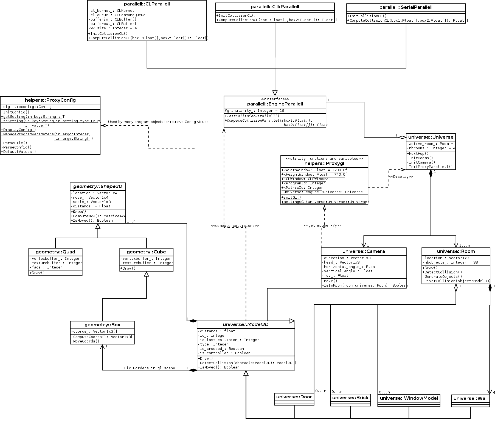

# enginepp

A 3d engine at very early stage and in working progress.
(C++ version of https://github.com/ricofehr/engine, with improved features)

The program generates randomly rooms with some randomly moving objects.
The camera can move with mouse (head orientation) and arrow keys (camera direction).

## Prerequisites

Needs Cmake (>3.1), OpenCL (1.2), CilkPlus and TBB, OpenGL3 (>3.3) and GLew / GLM / SOIL / Glfw libraries.

On ubuntu or Debian, apt-get make most of prerequisites install
```
# apt-get install cmake make g++ libx11-dev libgl1-mesa-dev libglu1-mesa-dev libxrandr-dev libxext-dev libglfw3-dev libsoil-dev libglm-dev libglew-dev opencl-headers libtbb-dev lsb-core libconfig++-dev
```

For OpenCL, we need gpu library, for intel gpu
```
# apt-get install beignet-dev
```

Or for nvidia gpu
```
# apt-get install nvidia-opencl-dev
```

And intel (for intel cpu) runtime
```
$ wget "http://registrationcenter-download.intel.com/akdlm/irc_nas/9019/opencl_runtime_16.1.1_x64_ubuntu_6.4.0.25.tgz"
$ tar xvfz opencl_runtime_16.1.1_x64_ubuntu_6.4.0.25.tgz
$ cd  opencl_runtime_16.1.1_x64_ubuntu_6.4.0.25 && ./install.sh
```

For CilkPlus installation, you can execute script below (detailed instructions on the [github page](https://github.com/cilkplus/cilkplus.github.com/blob/master/index.md#try-cilk-plusllvm)).
```
./scripts/./cilk_linux.sh
```

On OSX, we need XCode and install some libraries with brew (SOIL must be install manually)
```
$ brew install cmake glm glew glfw3 tbb libconfig
```

And SOIL must be install manually
```
$ git clone https://github.com/smibarber/libSOIL
$ cd libSOIL && make
$ sudo mkdir -p /usr/local/include/SOIL
$ sudo cp *.h /usr/local/include/SOIL/
$ sudo cp libSOIL.* /usr/local/lib/
```

And OpenCL must be install manually
```
$ wget https://github.com/KhronosGroup/OpenCL-CLHPP/releases/download/v2.0.10/cl2.hpp
$ sudo mv cl2.hpp /System/Library/Frameworks/OpenCL.framework/Headers/
```

For OpenCL header copy, need execute this in terminal on Recovery Mode
```
$ csrutil disable
```

For CilkPlus installation, you can execute script below (detailed instructions on the [github page](https://github.com/cilkplus/cilkplus.github.com/blob/master/index.md#try-cilk-plusllvm)).
```
./scripts/./cilk_osx.sh
```

## Compile

Step1, Before each compile, we need init env for cilkplus use.
On Linux
```
source ./scripts/./cilk_vars_linux.sh
```
On MacOS
```
source ./scripts/./cilk_vars_osx.sh
```

Step2, generate MakeFiles and check prerequisites
```
$ cmake .
-- Configuring done
-- Generating done
-- Build files have been written to: ~/enginepp
```

Step3, compile program
```
$ make
Scanning dependencies of target engine
[  5%] Building CXX object CMakeFiles/engine.dir/src/engine/geometry/shape3d.cc.o
[ 11%] Building CXX object CMakeFiles/engine.dir/src/engine/geometry/quad.cc.o
[ 17%] Building CXX object CMakeFiles/engine.dir/src/engine/geometry/cube.cc.o
[ 23%] Building CXX object CMakeFiles/engine.dir/src/engine/geometry/box.cc.o
[ 29%] Building CXX object CMakeFiles/engine.dir/src/engine/helpers/proxy_config.cc.o
[ 35%] Building CXX object CMakeFiles/engine.dir/src/engine/helpers/proxygl.cc.o
[ 41%] Building CXX object CMakeFiles/engine.dir/src/engine/parallell/cl_parallell.cc.o
[ 47%] Building CXX object CMakeFiles/engine.dir/src/engine/parallell/cilk_parallell.cc.o
[ 52%] Building CXX object CMakeFiles/engine.dir/src/engine/parallell/serial_parallell.cc.o
[ 58%] Building CXX object CMakeFiles/engine.dir/src/engine/universe/camera.cc.o
[ 64%] Building CXX object CMakeFiles/engine.dir/src/engine/universe/model3d.cc.o
[ 70%] Building CXX object CMakeFiles/engine.dir/src/engine/universe/wall.cc.o
[ 76%] Building CXX object CMakeFiles/engine.dir/src/engine/universe/brick.cc.o
[ 82%] Building CXX object CMakeFiles/engine.dir/src/engine/universe/room.cc.o
[ 88%] Building CXX object CMakeFiles/engine.dir/src/engine/universe/universe.cc.o
[ 94%] Building CXX object CMakeFiles/engine.dir/src/engine.cc.o
[100%] Linking CXX executable bin/engine
[100%] Built target engine
```

## Features

- C++14
- OpenCL 1.2
- CilkPlus / TBB
- Opengl 3
- Use of Glew, GLM, SOIL, Glfw libraries
- CMake for compile

## Folders
```
+--assets/  Texture files
+--bin/		Binary folder where engine executable is written
+--cl/      OpenCL Kernels folder
+--cmake/   Cmake modules folder
+--config/  Config folder
+--demos/	Demo gif animated files
+--dia/     Uml and span diagrams
+--glsl/    OpenGL Shaders folder
+--scripts/ Bash scripts
+--src/ 	Sources
```

## Settings

A default setting file is present at config/enginepp.ini.default
For local config change, we can duplicate this file
```
$ cp config/enginepp.ini.default config/enginepp.ini
$ vi config/enginepp.ini
```

It's also possible to change mostly setting on the fly with program parameters (See below).

## Run

Use mouse for head orientation and arrow keys for camera move.

Before run, we need init env for cilkplus use.
On Linux
```
source ./scripts/./cilk_vars_linux.sh
```
On MacOS
```
source ./scripts/./cilk_vars_osx.sh
```

Default run, without any parameter
```
bin/./engine  # Use settings as setted in config file (config/enginepp.ini or config/enginepp.ini.default).
```

Program accept options who can override config settings
```
-c n  Clipping, 0: no clipping, 1: low clipping, 2: high clipping
-d n  Debug mode, 0: no debug, 1: performance debug, 2: collision debug, 3: all debug
-e n  Execution Time, 0: no limit
-g n  Granularity on collision computes
-h    Display help
-l    Display config
-o n  Count of objects in rooms
-p serial|cilkplus|opencl
      serial: no parallellism
      cilkplus: use intel cilkplus library
      opencl: intel cilkplus for all parallell computes but opencl for collision computes
-r n  Count of rooms
```

For example
```
./bin/./engine -d 0 -p serial -o 24 -g 32 # no debug, no parallellism, 24 objects, 32 computes for collision
```


## Documentation

Doxy pages are available [here](http://oxy.enginepp.nextdeploy.io)

## UML


